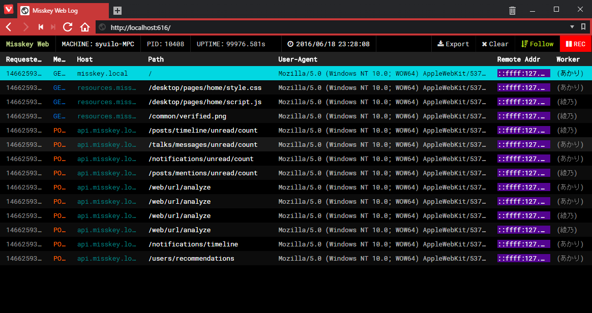

===========================

[![][npm-badge]][npm-link]
[![][travis-badge]][travis-link]
[![][david-badge]][david-link]
[![][david-dev-badge]][david-dev-link]
[![][mit-badge]][mit]

[](https://nodei.co/npm/accesses/)

A graphical access logger for [Node](https://github.com/nodejs/node).



Features
--------
* Frameworks support
  * [express](https://github.com/expressjs/express)
  * [koa](https://github.com/koajs/koa) (todo)
  * and more (todo)
* Cluster support
* Databases support (todo)

Install
-------
``` shell
$ npm install accesses --save
```

Usage
-----
### With [express](https://github.com/expressjs/express)

``` javascript
const express = require('express');
const Accesses = require('accesses');

const app = express();

// Set up
const accesses = new Accesses({
	appName: 'My Web Service',
	port: 616
});

// Register middleware
app.use(accesses.express);

app.get('/', (req, res) => {
	res.send('yeah');
});

app.listen(80);
```

Now, we can monitor accesses on localhost:616

Reference
---------
### options
| Property     | Type     | Description                      |
| ------------ | -------- | -------------------------------- |
| **appName**  | *string* | Your app name                    |
| **port**     | *number* | Port number that you want listen |
| **store**    | *Store*  | todo |

Contribution
------------
Issue reports, feature requests and pull requests are welcome!

License
-------
[MIT](LICENSE)

[npm-link]:        https://www.npmjs.com/package/accesses
[npm-badge]:       https://img.shields.io/npm/v/accesses.svg?style=flat-square
[mit]:             http://opensource.org/licenses/MIT
[mit-badge]:       https://img.shields.io/badge/license-MIT-444444.svg?style=flat-square
[travis-link]:     https://travis-ci.org/syuilo/accesses
[travis-badge]:    http://img.shields.io/travis/syuilo/accesses.svg?style=flat-square
[david-link]:      https://david-dm.org/syuilo/accesses#info=dependencies&view=table
[david-badge]:     https://img.shields.io/david/syuilo/accesses.svg?style=flat-square
[david-dev-link]:  https://david-dm.org/syuilo/accesses#info=devDependencies&view=table
[david-dev-badge]: https://img.shields.io/david/dev/syuilo/accesses.svg?style=flat-square
